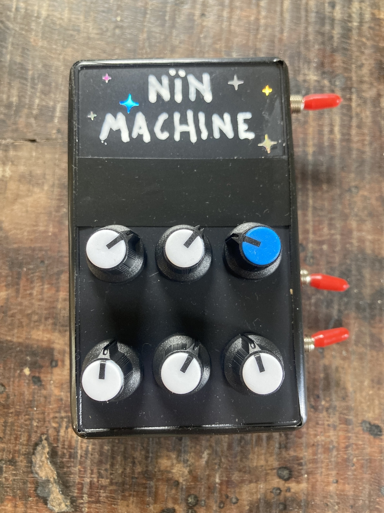

# Nïn Machine

A simple 5-drone Arduino Nano synth. Each drone has a fixed LFO.

Recipe:
- Take 5 10k pots. Wire one leg of each to ground via a 220 Ohm resistor (so we don't short anything).
  Wire the other leg to the 5V rail and wire the wiper to A0-A4 on the Arduino.
- Take 2 switches and wire one leg to ground and the other to D2/D3 on the Arduino. In parallel add
  10k resistors connecting the D2/D3 pins to 5V.
- Signal out to a 10k log pot, which then goes out to this
  [Mozzi output circuit](https://diyelectromusic.com/2020/09/17/mozzi-output-circuit-part-2/).

To run the test, just swap it with the main file and upload.